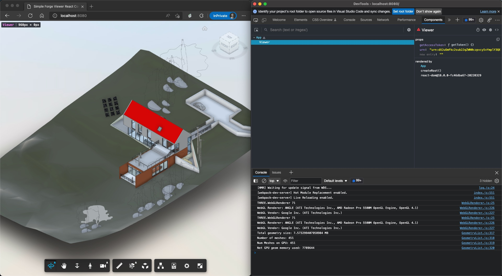

# forge-viewer-react-component-demo

# Description

This sample demonstrates how to integrate Forge Viewer in a React.js project.

## Thumbnail

# Setup

To use this sample, you will need Autodesk developer credentials. Visit the [Forge Developer Portal](https://developer.autodesk.com), sign up for an account, then [create an app](https://developer.autodesk.com/myapps/create). For this new app, use **http://localhost:3000/api/forge/callback/oauth** as the Callback URL, although it is not used on a 2-legged flow. Finally, take note of the **Client ID** and **Client Secret**.

### Run locally

Install [NodeJS](https://nodejs.org).

Clone this project or download it. It's recommended to install [GitHub Desktop](https://desktop.github.com/). To clone it via command line, use the following (**Terminal** on MacOSX/Linux, **Git Shell** on Windows):

    git clone https://github.com/yiskang/forge-viewer-react-component-demo.git

To run it, install the required packages. Via command line, navigate to the folder where this repository was cloned to and use the following commands:

    npm install
    npm run dev

Open the browser: [http://localhost:8080](http://localhost:8080).

## Troubleshooting

After installing GitHub Desktop for Windows, on the Git Shell, if you see the ***error setting certificate verify locations*** error, then use the following command:

    git config --global http.sslverify "false"

# License

This sample is licensed under the terms of the [MIT License](http://opensource.org/licenses/MIT).
Please see the [LICENSE](LICENSE) file for full details.

## Written by

Eason Kang [@yiskang](https://twitter.com/yiskang), [Forge Partner Development](http://forge.autodesk.com)